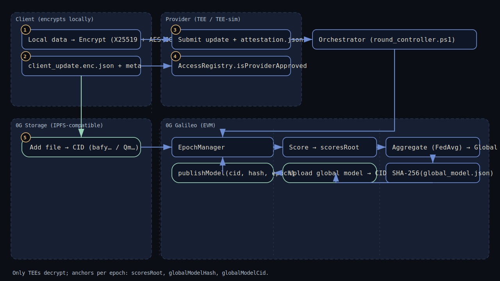

<!-- CI & Docs badges (rao) -->
[](https://github.com/balkeumlabs/tee-fl-0g/actions/workflows/ci-smoke.yml)


[](https://github.com/balkeumlabs/tee-fl-0g/blob/rao/docs/progress.md)

# tee-fl-0g — Federated Learning on 0G (Galileo) with Access-Gated Updates, On-Chain Anchoring, and FedAvg

<sub>Last update: 2025-09-14 19:22:47 UTC</sub>

**Quick links:** [Install](#quick-start) · [Usage](#usage) · [Architecture](#visual-overview) · [Deep-Dive](#engineering-deep-dive) · [Roadmap](#roadmap-and-milestones)

---

## Summary

This repo demonstrates a working federated-learning pipeline on the 0G Galileo testnet: providers submit access-gated updates, we score and aggregate with FedAvg, anchor model hashes and metadata on-chain, and publish one model per epoch. Current state: end-to-end demo works with simulated storage CIDs; next steps are real 0G Storage CIDs, client-side encryption, and attestation metadata.

---

## Visual Overview



<details>
<summary>ASCII fallback</summary>

[Client datasets (enc)] -> [0G Storage (CID)]  
[Provider (TEE sim)] -> [Update JSON + meta] -> AccessRegistry, EpochManager  
EpochManager -> [Score & Merkle root] -> [FedAvg] -> [Global model] -> EpochManager  
[Orchestrator (round_controller.ps1)] -> AccessRegistry, EpochManager

</details>

---

## Table of Contents

- [Quick Start](#quick-start)
- [Features and Non-Goals](#features-and-non-goals)
- [Usage](#usage)
- [Configuration](#configuration)
- [Deployment](#deployment)
- [Observability](#observability)
- [Engineering Deep-Dive](#engineering-deep-dive)
  - [System Model and Assumptions](#system-model-and-assumptions)
  - [Threat Model](#threat-model)
  - [Cryptography and Key Management](#cryptography-and-key-management)
  - [TEE Design and Attestation](#tee-design-and-attestation)
  - [Protocols and Algorithms](#protocols-and-algorithms)
  - [On-Chain Integration (0g/EVM)](#on-chain-integration-0gevem)
  - [Performance and Benchmarks](#performance-and-benchmarks)
  - [Reliability and Failure Modes](#reliability-and-failure-modes)
  - [Security and Privacy Validation](#security-and-privacy-validation)
  - [Reproducibility](#reproducibility)
  - [Artifacts and Evidence](#artifacts-and-evidence)
- [Engineering & Project Ops](#engineering--project-ops)
  - [Development](#development)
  - [Development — Policy & CI](#development--policy--ci)
  - [Roadmap and Milestones](#roadmap-and-milestones)
  - [FAQ and Troubleshooting](#faq-and-troubleshooting)
  - [Contributing and Code of Conduct](#contributing-and-code-of-conduct)
  - [Versioning and Changelog Policy](#versioning-and-changelog-policy)
  - [License and Notices](#license-and-notices)
  - [Acknowledgements](#acknowledgements)
- [Handoff & Quality Gates](#handoff--quality-gates)
- [Self-Check and Validators](#self-check-and-validators)
- [Note on CIDs](#note-on-cids)

---

## Quick Start

### Prerequisites

- Windows 10/11, PowerShell 7, Node.js ≥ 18 (Node 22 OK), npm ≥ 9, Git  
- Funded EVM key on 0G Galileo testnet (chainId 16601)  
- RPC endpoint: https://evmrpc-testnet.0g.ai

### Clone and build

```powershell
# Windows
Set-Location $env:USERPROFILE
git clone https://github.com/balkeumlabs/tee-fl-0g.git
Set-Location .\tee-fl-0g
npm ci
npx hardhat compile --config .\hardhat.galileo.js
```

### Configure environment

Copy `.env.example` to `.env` and set:  
- `PRIVATE_KEY`  
- `RPC_ENDPOINT=https://evmrpc-testnet.0g.ai`  
- `FL_ENC_MODE=dev`  
- `FL_TEE_PUBKEY_B64=BASE64_X25519_PUBKEY`

### Sanity checks

```powershell
node .\scripts\check_balance_raw.js
'{"round":1,"weights":[0.1,0.2,0.3]}' | Set-Content -Encoding UTF8 .\sample_update.json
node .\dist\crypto\encrypt_update.js --in .\sample_update.json --out .\sample_update.enc.json
node .\dist\crypto\decrypt_update.js --in .\sample_update.enc.json --out .\sample_update.decrypted.json
# Compare sample_update.json and sample_update.decrypted.json — they should be identical.
```

### Local aggregate (no chain, no upload)

```powershell
node .\dist\local_normalize_and_aggregate.js --in-dir . --out-dir . --on-mismatch pad --force-path '$.weights'
# Emit simple metadata
$b=[IO.File]::ReadAllBytes('aggregated_model.json'); $h=[BitConverter]::ToString((New-Object Security.Cryptography.SHA256Managed).ComputeHash($b)).Replace('-','').ToLower(); "{`"file`":`"aggregated_model.json`",`"size`":"+ $b.Length +",`"sha256`":`"$h`"}" | Set-Content -Encoding UTF8 aggregated_model.storage_meta.json
```

### End-to-end demo (chain)

```powershell
node .\scripts\is_approved_raw.js --provider 0xYOUR_ADDRESS
node .\scripts\start_epoch_once_raw.js --epoch 3
node .\scripts\submit_update_checked_raw.js --file .\sample_update.enc.json --meta .\aggregated_model.storage_meta.json
node .\scripts\compute_scores_and_post_root_raw.js --epoch 3
node .\scripts\aggregate_and_publish_raw.js --epoch 3 --force-path '$.weights'
```

Expected: `scoresRoot`, `globalModelHash`, `globalModelCid` (CID simulated unless supplied) logged.

---

## Features and Non-Goals

**Features:**
- Access gating via `AccessRegistry.isProviderApproved`
- Epoch lifecycle: start → submit → score (dummy) → scoresRoot → FedAvg → publish once
- On-chain anchoring per epoch: `scoresRoot`, `globalModelHash`, `globalModelCid`
- Secure wrapper `dist/round_secure.ps1` enforces encryption and scrubs plaintext

**Non-Goals (current phase):**
- Real 0G Storage writes (upload path prepared)
- Verified TEE attestation (validator scaffold present; enforcement WIP)
- Marketplace pay-per-inference flow (to be mapped)

---

## Usage

Key scripts:
- `deploy_access_raw.js`
- `deploy_epoch_raw.js`
- `start_epoch_once_raw.js`
- `grant_access_raw.js` / `is_approved_raw.js`
- `submit_update_checked_raw.js`
- `compute_scores_and_post_root_raw.js`
- `aggregate_and_publish_raw.js`
- `read_update_raw.js` / `read_epoch_meta_raw.js`

Secure round wrapper:
```powershell
powershell -NoProfile -ExecutionPolicy Bypass -File .\dist\round_secure.ps1 -RoundController .\round_controller.ps1 -WorkDir .
```

---

## Configuration

`.env` keys (summary):
- `PRIVATE_KEY` (hex, secret)
- `RPC_ENDPOINT` (default https://evmrpc-testnet.0g.ai)
- `OG_STORAGE_MODE` (`manual` | `ipfs-api`)
- `OG_STORAGE_API_BASE`, `OG_STORAGE_API_TOKEN`, `OG_GATEWAY_BASE`
- `FL_ENC_MODE` (`dev` | `off`)
- `FL_TEE_PUBKEY_B64`, `FL_TEE_PRIVKEY_B64`, `FL_CLIENT_PRIVKEY_B64`
- `FL_ENC_DELETE_PLAINTEXT` (0|1)
- `DRY_RUN` (0|1), `LOCAL_UPLOAD` (0|1)
- `TEE_ATTEST_MEAS_ALLOWLIST`, `TEE_ATTEST_ENCLAVE_ID`

---

## Deployment

Network: 0G Galileo (chainId 16601)  
Deployer / signer: `0x9Ed57870379e28E32cb627bE365745dc184950dF`

Contracts:
- AccessRegistry: `0xE3bffF639B4522Fa3D1E72973f9BEc040504c21e`
- EpochManager:  `0x9341619f6B889A12bbb90BbE366405ce363Ab779`

CI (smoke):
- `.github/workflows/ci-smoke.yml` on push/PR to `rao`
- Steps: Node setup → npm ci → Hardhat compile → mocked round → archive artifacts
- Badge reflects latest `rao` run

Rollback:
- `publishModel` is single-shot per epoch; if wrong, start a new epoch and republish
- `git revert <sha>` for bad commits; keep addresses snapshots per deploy

---

## Observability

```
read_epoch_meta_raw.js --epoch 3
is_approved_raw.js --provider 0xYOUR_ADDRESS
```

List `aggregated_model*storage_meta.json` files to confirm SHA entries.

---

## Engineering Deep-Dive

### System Model and Assumptions
- Actors: Client, Provider (TEE/TEE-sim), Aggregator, Chain (0G), Storage (0G)
- Only TEEs decrypt client data; one `publishModel` per epoch

### Threat Model
- Assets: Encrypted updates, model weights, keys, attestation
- Adversaries: malicious providers, curious storage nodes, on-chain observers
- Mitigations: access gating + on-chain hashes; next: client-side encryption, attestation

### Cryptography and Key Management
- Plan: X25519 + AES-GCM; per-epoch nonces; SHA-256 integrity
- Dev: `.env`; Prod: vault/KMS; decrypt only in TEE

### TEE Design and Attestation
- Target SGX/TDX or SEV-SNP
- Submit attaches attestation JSON (mrenclave/mrsigner/svn); scoring checks allowlist (simulated)

### Protocols and Algorithms
- Submit → CID on storage → on-chain reference
- Score → `scoresRoot`
- Aggregate → FedAvg → `globalModelHash` → `publishModel(CID, hash)` once

### On-Chain Integration (0g/EVM)
- chainId 16601; RPC https://evmrpc-testnet.0g.ai
- Anchors per epoch: `scoresRoot`, `globalModelHash`, `globalModelCid`

### Performance and Benchmarks
- PoC baseline small logistic regression; seconds per epoch publish locally
- Next: timings for N=5–50; gas per submit/publish

### Reliability and Failure Modes
- Idempotent epoch creation; publish guarded once
- Retry RPC; cache local artifacts and CIDs

### Security and Privacy Validation
- No plaintext when secure wrapper is used; hashes anchored on-chain
- Next: encryption everywhere; attestation enforcement; storage integrity checks

### Reproducibility
- `npm ci`; pinned solc; fixed Hardhat config
- Record commit SHA with epoch id in logs

### Artifacts and Evidence
- Local: `client_update_*.json`; `aggregated_model.json`; `aggregated_model.storage_meta.json`
- On-chain PoC examples:
  - Epoch 1: `scoresRoot=0x3606…bb157`; `globalModelCid=cid://simulated/global-1757444721`; `hash=0x5e47…38fc`; published
  - Epoch 2: `scoresRoot=0x391a…94fb`; `weights≈[0.01,-0.01,0.025]`; `globalModelCid=cid://simulated/global-1757446457`; `hash=0x2031…7278e`; published

---

## Engineering & Project Ops

### Development
- Layout: `contracts/`, `scripts/`, `dist/`, `docs/`
- PowerShell-first automation; Visual Studio preferred; VS Code optional

### Development — Policy & CI

Plaintext encryption guard and attestation gating are enforced locally via a Git pre-commit hook.  
CI smoke replicates these checks and produces SHA-256 evidence without needing storage/CIDs.

**Pre-commit policy (local)**  
The hook blocks plaintext client updates and requires an allow-listed attestation measurement.

- `scripts/guard_plaintext.ps1` → fails if `FL_TEE_PUBKEY_B64` is unset or any `client_update*.json` lacks `"ciphertext"`.  
- `scripts/attestation_enforce.js` → ensures `attestation_example.json.measurement` is present in `attestation_allowlist.json`.

**One-time setup after cloning (installs the hook):**
```powershell
pwsh -File .\scripts\install_hooks.ps1
# Verify the hook exists (no extension)
Get-Item .\.git\hooks\pre-commit
```

**Quick self-test (hook should block plaintext, then pass after cleanup):**
```powershell
# Create a dummy PLAINTEXT update (no "ciphertext" field)
'{"round":123,"weights":[1,2,3]}' | Set-Content -Encoding UTF8 .\client_update_hook_test.json
# Force-add it despite .gitignore so the hook runs
git add -f .\client_update_hook_test.json
# Try to commit → EXPECT failure with guard error
git commit -m "test: hook should block plaintext"
# Cleanup
git reset HEAD .\client_update_hook_test.json
Remove-Item .\client_update_hook_test.json -Force
# Sanity: guard should now report OK
powershell -NoProfile -ExecutionPolicy Bypass -File .\scripts\guard_plaintext.ps1
```

**CI smoke (CID-free)**  
The GitHub Actions workflow compiles, runs deterministic aggregation, computes SHA-256 evidence, enforces attestation + plaintext guard, and uploads artifacts — with no dependency on 0G storage or CIDs.  
See runs under GitHub → Actions for branch `rao`.

**Byte-stability & EOL rules**  
Aggregates and client updates are marked `-text` in `.gitattributes` to preserve exact bytes (future SHA/CID stability).  
Attestation JSON and docs are normalized to LF to silence CRLF warnings.

**Verify locally (read-only checks):**
```powershell
# Expect: -text on aggregates/updates
git check-attr -a -- aggregated_model.json | Select-String text
git check-attr -a -- client_update_round1.enc.json | Select-String text
# Expect: text eol=lf on attestation JSON
git check-attr -a -- attestation_example.json | Select-String eol
```

### Roadmap and Milestones
1) Real 0G Storage CIDs wired into submit/publish paths  
2) Enforce client-side encryption; TEE-only decrypt  
3) Attestation metadata + verification in scoring  
4) CI smoke on PRs; badges green  
5) Contract extensions (attestation refs, inference receipts)  
6) Map final model into 0G Service Marketplace

### FAQ and Troubleshooting
- `publishModel` reverted → already published; open a new epoch  
- `isProviderApproved=false` → `grant_access_raw.js` for provider  
- Only simulated CIDs → storage wiring pending  
- Windows execution policy errors → use `-ExecutionPolicy Bypass`

### Contributing and Code of Conduct
- PRs with clear descriptions and logs; security-first etiquette

### Versioning and Changelog Policy
- Semver-ish tags for PoC milestones; per-PR changelog once CI is live

### License and Notices
- MIT; see `LICENSE`

### Acknowledgements
- 0G Labs (Galileo), Balkeum Labs team (Eli, Umar, Rao), open-source maintainers

---

## Handoff & Quality Gates

Repo: `balkeumlabs/tee-fl-0g` (rao branch)  
Network: 0G Galileo, chainId 16601  
Deployer: `0x9Ed57870379e28E32cb627bE365745dc184950dF`  
Contracts: AccessRegistry `0xE3bf…c21e`; EpochManager `0x9341…b779`

**Acceptance checklist:**
- `npm ci` → Hardhat compile OK  
- Provider approved → submit succeeds  
- `scoresRoot` posted for epoch  
- Aggregation deterministic; sha256 logged  
- `publishModel` called once; `globalModelHash` matches local SHA  
- No plaintext updates left when secure wrapper used

---

## Self-Check and Validators

```powershell
node .\scripts\attestation_check.js --attestation .\attestation_example.json --allowlist .\attestation_allowlist.json
powershell -NoProfile -ExecutionPolicy Bypass -File .\dist\round_secure.ps1 -RoundController .\dist\round_dummy.ps1 -WorkDir .
Get-Content .\aggregated_model.storage_meta.json | ConvertFrom-Json | Format-List
```

---

## Note on CIDs

Until 0G Storage is fully live, generate metadata locally and (optionally) bind a real CID later:

```powershell
node .\dist\upload_to_0g_storage.js --file .\aggregated_model.json --dry-run
node .\dist\upload_to_0g_storage.js --file .\aggregated_model.json --cid bafy... --name aggregated_model.json
```


System.Func`2[System.Text.RegularExpressions.Match,System.String]


System.Func`2[System.Text.RegularExpressions.Match,System.String]


