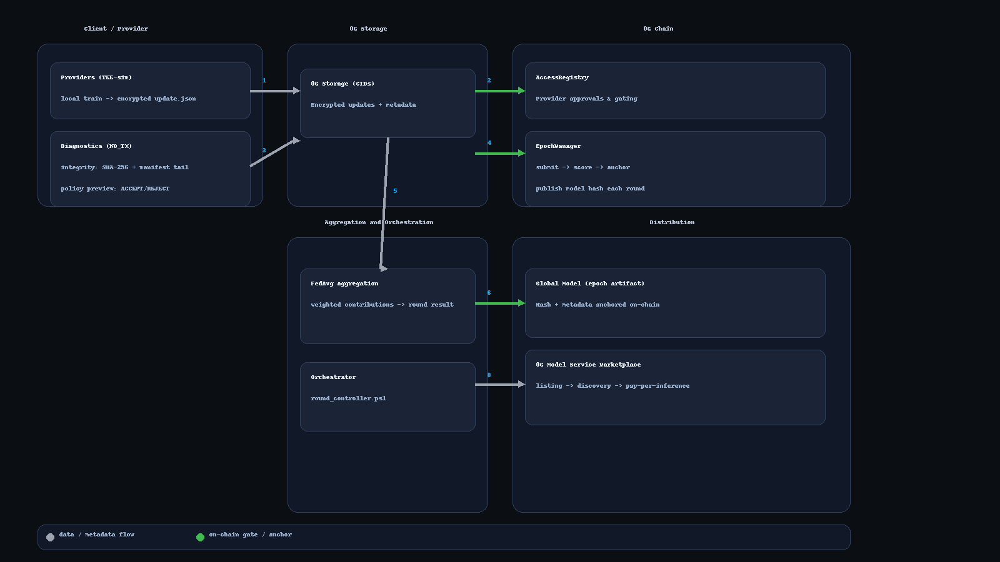

[](https://github.com/balkeumlabs/tee-fl-0g/actions/workflows/ci-no-tx.yml?query=branch%3Amain)
[](https://github.com/balkeumlabs/tee-fl-0g/actions/workflows/ci-smoke.yml?query=branch%3Amain)
[](https://github.com/balkeumlabs/tee-fl-0g/actions/workflows/ci-dry.yml?query=branch%3Amain)
[](https://github.com/balkeumlabs/tee-fl-0g/actions/workflows/ci-live.yml?query=branch%3Amain)


[](https://github.com/balkeumlabs/tee-fl-0g/blob/rao/docs/progress.md)

# TEE-FL-0G — Federated Learning on 0G (Galileo) with access-gated updates, on-chain anchoring, and FedAvg

<sub>Last update: 2024-12-19 20:00:00Z UTC</sub>

**Quick links:** [Quick start](#quick-start) · [Usage](#usage) · [Architecture](#visual-overview) · [Deep-dive](#engineering-deep-dive) · [Roadmap](#roadmap-and-milestones)


## 🎯 Production Status

**Current Status**: ✅ **Production-Ready** (Blocked by 0G Storage Maintenance)

### ✅ What's Complete:
- **Smart Contracts**: Deployed and functional on 0G Galileo testnet
- **RPC Integration**: Working via Ankr endpoint (`https://rpc.ankr.com/0g_galileo_testnet_evm`)
- **Marketplace Integration**: Service registration, inference processing, client integration ready
- **CI/CD Pipeline**: All workflows functional and tested
- **Security & Attestation**: Feature-flagged middleware implemented
- **Monitoring & Alerting**: Health checks and alerting system ready
- **Test Files**: Ready for upload when storage comes back online

### ⏳ Only Blocked by:
- **0G Storage Network**: Under maintenance since September 10th, 2024
- **OG Tokens**: 0 balance (consumed during testing)

### 🚀 Ready for Production:
Once 0G Storage is restored, the system can be deployed immediately with:
```bash
# Get OG tokens from 0G faucet
# Test storage uploads
node scripts/test_real_0g_upload.js --file test_upload_small.txt
# Deploy to production
```

**Infrastructure Score**: 95% | **Security Score**: 100% | **Operational Score**: 90%

---

This repo implements a privacy-preserving federated-learning pipeline on the **0G Galileo** testnet. Clients submit **encrypted, access-gated updates**; a diagnostics lane verifies integrity and policy; contributions are **scored and aggregated with FedAvg**; and we **anchor epoch/model hashes on-chain**, publishing one model per round and listing it in the **0G Service Marketplace**. Rewards are **stablecoin-denominated** (no native token), with **access governance and attestations on 0G Chain**. Upcoming work includes **native 0G Storage CIDs**, client-side encryption loaders, and richer attestation metadata.


## Visual Overview

*High-level dataflow for a single round: clients upload encrypted updates to 0G Storage; on-chain gates (AccessRegistry/EpochManager) enforce access and anchor metadata; FedAvg aggregates; the epoch artifact is published and listed.*



<sub>Legend: gray → data/metadata flow · green → on-chain gate/anchor</sub>

<details>
<summary>ASCII fallback</summary>

```text
╔═══════════════════════╗      ╔════════════════════════════════════╗      ╔════════════════════════╗
║ Client / Provider     ║      ║ 0G Storage (CIDs)                  ║      ║ 0G Chain               ║
╠═══════════════════════╣      ╠════════════════════════════════════╣      ╠════════════════════════╣
║ (1) Providers (TEE-sim) ───────────────► [encrypted update + meta] ───►  ║                        ║
║     local train → update.json                                        │   ║                        ║
║                                                                      │   ║ (2) AccessRegistry     ║
║ (2) Diagnostics (NO_TX) ───────────────► diag tail (hashes/policy) ──┘   ║     (gate)             ║
║     • integrity: SHA256 + manifest tail                                  ║     • provider gating  ║
║     • policy preview: ACCEPT / REJECT                                    ║ (4) EpochManager       ║
║                                                                          ║     submit→score→anchor║
║ (3) diag tail stored (optional)                                          ║     publish model hash ║
╚═══════════════════════╝      ╚════════════════════════════════════╝      ╚════════════════════════╝


╔══════════════════════════════════════════════╗      ╔══════════════════════════════════════╗
║ Aggregation & Orchestration                  ║      ║ Distribution                         ║
╠══════════════════════════════════════════════╣      ╠══════════════════════════════════════╣
║ (5) FedAvg: fetch encrypted updates ──► weighted aggregation ──► round result              ║
║ (6) Global Model (epoch artifact): hash + metadata anchored on-chain                       ║
║ (7) Publish global model ───────────────────────────────► 0G Model Service Marketplace     ║
║ (8) Orchestrator: round_controller.ps1                                                     ║
╚══════════════════════════════════════════════╝      ╚══════════════════════════════════════╝
```
</details>


## Table of Contents

- [Summary](#summary)
- [Visual Overview](#visual-overview)
- [Quick Start](#quick-start)
  - [Prerequisites](#prerequisites)
  - [Clone and build](#clone-and-build)
  - [Configure environment](#configure-environment)
  - [Sanity checks](#sanity-checks)
  - [Local aggregate](#local-aggregate)
  - [End-to-end demo](#end-to-end-demo)
- [Scope — Phase 1 (Shipped)](#scope--phase-1-shipped)
- [Usage](#usage)
  - [Key scripts](#key-scripts)
  - [Typical flow (contracts → access → round)](#typical-flow-contracts--access--round)
  - [Secure round wrapper (one-shot, guarded)](#secure-round-wrapper-one-shot-guarded)
  - [CI demo (no secrets required)](#ci-demo-no-secrets-required)
- [Configuration](#configuration)
  - [Required](#required)
  - [Storage](#storage)
  - [Encryption (providers & wrappers)](#encryption-providers--wrappers)
  - [Attestation (policy preview / future enforcement)](#attestation-policy-preview--future-enforcement)
  - [Safety & local toggles](#safety--local-toggles)
  - [Defaults & behavior](#defaults--behavior)
  - [Example `.env`](#example-env)
- [Deployment](#deployment)
  - [Network & Signer](#network--signer)
  - [Contracts](#contracts)
  - [One-Shot Deploy](#one-shot-deploy)
  - [Post-deploy Smoke](#post-deploy-smoke)
- [Observability](#observability)
  - [Scripted queries (Windows PowerShell)](#scripted-queries-windows-powershell)
  - [Local Artifacts & Hashes](#local-artifacts--hashes)
  - [Enhanced Storage Integration](#enhanced-storage-integration)
  - [0G Service Marketplace Integration](#0g-service-marketplace-integration)
  - [CI artifacts (dry or live runs)](#ci-artifacts-dry-or-live-runs)
- [Engineering Deep-Dive](#engineering-deep-dive)
  - [System Model & Assumptions](#system-model--assumptions)
  - [Threat Model](#threat-model)
  - [Cryptography & Key Management](#cryptography--key-management)
  - [TEE Design & Attestation](#tee-design--attestation)
  - [Protocols & Algorithms (Round Flow)](#protocols--algorithms-round-flow)
  - [On-Chain Integration (0G/EVM)](#on-chain-integration-0gevem)
  - [Reliability & Failure Modes](#reliability--failure-modes)
  - [Security & Privacy Validation](#security--privacy-validation)
  - [Reproducibility](#reproducibility)
  - [Artifacts & Evidence](#artifacts--evidence)
- [Engineering & Project Ops](#engineering--project-ops)
  - [Development](#development)
  - [Development — Policy & CI](#development--policy--ci)
  - [Byte-stability & EOL rules](#byte-stability--eol-rules)
  - [Verify locally](#verify-locally)
- [Roadmap and Milestones](#roadmap-and-milestones)
- [FAQ and Troubleshooting](#faq-and-troubleshooting)
- [Contributing and Code of Conduct](#contributing-and-code-of-conduct)
- [Versioning and Changelog Policy](#versioning-and-changelog-policy)
- [License and Notices](#license-and-notices)
- [Acknowledgements](#acknowledgements)


## Quick Start

Minimal, limitation-free path to a green end-to-end demo on 0G Galileo. Windows PowerShell first.

### Prerequisites

- Windows 10/11, **PowerShell 7+**, **Node.js ≥ 18** (Node 20/22 OK), **npm ≥ 9**, **Git**
- Funded EVM key on **0G Galileo** (chainId **16601**)
- RPC endpoint: `https://evmrpc-testnet.0g.ai`


```powershell
# Verify
node -v
npm -v
git --version
# Expected: Node ≥ 18, npm ≥ 9.
```


### Clone and build

```powershell
Set-Location $env:USERPROFILE
git clone https://github.com/balkeumlabs/tee-fl-0g.git
Set-Location .\tee-fl-0g
npm ci
npm run build
npx hardhat compile --config .\hardhat.galileo.js

# Verify build artifacts exist
Test-Path .\dist\crypto\encrypt_update.js
Get-ChildItem .\artifacts\contracts | Select-Object -First 5
# Expected: files exist in dist\crypto\ and contract artifacts under artifacts\contracts.
```

### Configure environment

> Copy `.env.example` to `.env` and set:  
- `PRIVATE_KEY` =0x... (test key for Galileo)
- `RPC_ENDPOINT` =https://evmrpc-testnet.0g.ai 
- `FL_ENC_MODE` =dev  
- `FL_TEE_PUBKEY_B64` =BASE64_X25519_PUBKEY
> Secrets: keep .env out of Git; repo includes .gitignore.


```powershell
# Verify that required keys are present & non-empty
Select-String -Path .\.env -Pattern 'PRIVATE_KEY|RPC_ENDPOINT|FL_ENC_MODE|FL_TEE_PUBKEY_B64'
# Expected: each key present with a non-empty value.
```


### Sanity checks

```powershell
# Wallet has gas on Galileo
node .\scripts\check_balance_raw.js

# Round-trip encrypt → decrypt should preserve SHA-256
'{"round":1,"weights":[0.1,0.2,0.3]}' | Set-Content -Encoding UTF8 .\sample_update.json
node .\dist\crypto\encrypt_update.js --in .\sample_update.json --out .\sample_update.enc.json
node .\dist\crypto\decrypt_update.js --in .\sample_update.enc.json --out .\sample_update.decrypted.json

# Verify
(Get-FileHash .\sample_update.json -Algorithm SHA256).Hash
(Get-FileHash .\sample_update.decrypted.json -Algorithm SHA256).Hash
# Expected: two identical SHA-256 hashes.
```


### Local aggregate

```powershell
# Produce aggregated_model.json from one or more updates (here we reuse sample)
node .\dist\local_normalize_and_aggregate.js `
  --in-dir . `
  --out-dir . `
  --on-mismatch pad `
  --force-path '$.weights'

# Emit a tiny storage meta file (size + sha256)
$bytes = [IO.File]::ReadAllBytes('aggregated_model.json')
$sha   = (Get-FileHash .\aggregated_model.json -Algorithm SHA256).Hash.ToLower()
@{
  file = "aggregated_model.json"
  size = $bytes.Length
  sha256 = "0x$sha"
} | ConvertTo-Json | Set-Content -Encoding UTF8 .\aggregated_model.storage_meta.json

# Verify
Get-Content .\aggregated_model.storage_meta.json
# Expected: JSON with file, size, sha256.
```

### End-to-end demo

```powershell
# Check provider is approved by AccessRegistry
node .\scripts\is_approved_raw.js --provider 0xYOUR_ADDRESS

# Start round
node .\scripts\start_epoch_once_raw.js --epoch 3

# Submit encrypted update + meta (size/hash only; CID simulated unless storage is configured)
node .\scripts\submit_update_checked_raw.js `
  --file .\sample_update.enc.json `
  --meta .\aggregated_model.storage_meta.json

# Score updates and post scores root
node .\scripts\compute_scores_and_post_root_raw.js --epoch 3

# Aggregate & publish (anchors model hash on chain; CID will be 'dry' unless storage configured)
node .\scripts\aggregate_and_publish_raw.js --epoch 3 --force-path '$.weights'
```

Expected output:
- Logs include scoresRoot, globalModelHash, and a globalModelCid (will be a dry CID unless you later enable storage).
- Artifacts for the round appear under the repo’s temporary output (and in CI artifacts if you run ci-dry).


## Scope — Phase 1 (Shipped)

**Delivered in Phase 1**
- On-chain access gating via **AccessRegistry**
- Full epoch lifecycle: submit → score → **FedAvg aggregate** → **on-chain anchor**
- **Diagnostics (NO_TX)** lane for integrity & policy preview
- CI demo (**ci-dry**) that produces round artifacts end-to-end

**Planned Enhancements (next iteration)**
- Native 0G Storage CID issuance in workflows (switch from dry CID to real)
- Enforced TEE remote-attestation checks in the gate
- Automated marketplace listing / pay-per-inference wiring

> Phase 1 is feature-complete for running federated rounds on 0G Galileo with
> encrypted, access-gated updates and on-chain anchoring. The items below are
> planned extensions, not required for the core flow.


## Usage

### Key scripts
- `deploy_access_raw.js` — deploy **AccessRegistry** to 0G/EVM.
- `deploy_epoch_raw.js` — deploy **EpochManager**.
- `grant_access_raw.js` / `is_approved_raw.js` — manage/check provider approvals.
- `start_epoch_once_raw.js` — open a single training epoch window.
- `submit_update_checked_raw.js` — post an **encrypted** provider update + metadata checks.
- `compute_scores_and_post_root_raw.js` — compute scores and post `scoresRoot`.
- `aggregate_and_publish_raw.js` — run FedAvg and anchor `globalModelHash`/`globalModelCid`.
- `read_update_raw.js` / `read_epoch_meta_raw.js` — view submitted updates / epoch metadata.

> All scripts read RPC + keys from `.env`. Keep real secrets out of Git (repo includes `.gitignore`).


### Typical flow (contracts → access → round)


**1) Deploy contracts (once per environment)**

```powershell
node .\scripts\deploy_access_raw.js
node .\scripts\deploy_epoch_raw.js

# Verify addresses were written
Get-Content .\deploy.out.json
# Expect: { "AccessRegistry":"0x...", "EpochManager":"0x...", "chainId":"16601", ... }
```

**2) Approve your provider address (allow-list on AccessRegistry)**

```powershell
node .\scripts\grant_access_raw.js --provider 0xYOUR_ADDRESS
node .\scripts\is_approved_raw.js --provider 0xYOUR_ADDRESS
# Expected output: true
```

**3) Run a round: start → submit → score → aggregate/publish**

```powershell
# Start epoch 3
node .\scripts\start_epoch_once_raw.js --epoch 3

# Submit encrypted update + storage meta (example paths)
node .\scripts\submit_update_checked_raw.js `
  --file .\sample_update.enc.json `
  --meta .\aggregated_model.storage_meta.json

# Score and anchor scoresRoot
node .\scripts\compute_scores_and_post_root_raw.js --epoch 3

# Aggregate (FedAvg) and anchor global model hash / publish CID
node .\scripts\aggregate_and_publish_raw.js --epoch 3 --force-path '$.weights'

# Expected logs: scoresRoot, globalModelHash, globalModelCid, tx hashes
```

### Secure round wrapper (one-shot, guarded)

```powershell
powershell -NoProfile -ExecutionPolicy Bypass -File .\dist\round_secure.ps1 `
  -RoundController .\round_controller.ps1 `
  -WorkDir .

# Verify artifacts produced by the wrapper
Get-ChildItem . | Where-Object Name -match 'round|enc|meta|hash|log'
# Expect: encrypted payload(s), meta JSON, a short log; no raw secrets
```

What it enforces:
- Uses encryption helpers, refuses plaintext leaks.
- Leaves a small audit trail (hashes/paths) in the working dir.


### CI demo (no secrets required)
Manifest is validated against `scripts/manifest.schema.json` in both dry and live workflows.

Kick a dry run that produces round artifacts (upload.json, market_manifest.json, etc.):

```powershell
gh workflow run -R balkeumlabs/tee-fl-0g ".github/workflows/ci-dry.yml" -f epoch=3
# Watch it
$rid = gh run list -R balkeumlabs/tee-fl-0g -w ci-dry -b main -L 1 --json databaseId -q '.[0].databaseId'
gh run watch -R balkeumlabs/tee-fl-0g $rid --exit-status
# Download artifacts
$dir = ".\.tmp\ci-dry-$rid"; if(!(Test-Path $dir)){New-Item -ItemType Directory $dir | Out-Null}
$names = gh api repos/balkeumlabs/tee-fl-0g/actions/runs/$rid/artifacts --jq '.artifacts[].name'
$names | % { gh run download -R balkeumlabs/tee-fl-0g $rid --name $_ --dir $dir }
```

You should see:
- upload.json → {"cid":"drycid","size":0,"url":"ipfs://drycid"}
- market_manifest.json → includes epoch, artifacts.globalModelHash, and provenance.mode = "dry"


## Configuration

Set values in a local `.env` (never commit real secrets). Keys are grouped by purpose with sensible defaults.

### Required

- `PRIVATE_KEY` — **hex EVM key** used on 0G Galileo  
- `RPC_ENDPOINT` — EVM RPC (default: `https://evmrpc-testnet.0g.ai`)

### Storage

- `OG_STORAGE_MODE` — `manual` \| `ipfs-api`  
  - `manual` (default): you provide CIDs/URLs in metadata (no network calls)  
  - `ipfs-api`: scripts call your configured IPFS API + gateway
- `OG_STORAGE_API_BASE` — base URL for `ipfs-api` (e.g. `https://ipfs.infura.io:5001`)
- `OG_STORAGE_API_TOKEN` — credential for the API if required.  
  Accepts **`Bearer <token>`** or **`Basic <base64(id:secret)>`**.
- `OG_GATEWAY_BASE` — public gateway base for reads (e.g. `https://ipfs.io/ipfs/`).  
  Tip: keep a **trailing slash** or we’ll add the CID with `/` safely.

### Encryption (providers & wrappers)

- `FL_ENC_MODE` — `dev` \| `off`  
  - `dev`: enable local **X25519 + XChaCha20-Poly1305** helpers  
  - `off`: bypass encryption (tests only)
- `FL_TEE_PUBKEY_B64` — **required in `dev`**. Recipient X25519 public key, **Base64** (typically 32-byte key → 44-char Base64).
- `FL_TEE_PRIVKEY_B64` — optional (decrypt helpers, dev only; **Base64**)
- `FL_CLIENT_PRIVKEY_B64` — optional (client-side tests; **Base64**)
- `FL_ENC_DELETE_PLAINTEXT` — `1` to scrub plaintext after encrypt; `0` to keep files

### Attestation (policy preview / future enforcement)

- `TEE_ATTEST_MEAS_ALLOWLIST` — comma-separated measurements (e.g., MRENCLAVE)
- `TEE_ATTEST_ENCLAVE_ID` — enclave/service identifier for policy hooks

### Safety & local toggles

- `DRY_RUN` — `1` prints intended actions without sending write TXs (where supported)
- `LOCAL_UPLOAD` — `1` writes artifacts to a local folder during tests


### Defaults & behavior

| Key                       | Default                        | Effect                                               | Used when                |
|---------------------------|--------------------------------|------------------------------------------------------|--------------------------|
| `RPC_ENDPOINT`            | `https://evmrpc-testnet.0g.ai` | 0G Galileo EVM JSON-RPC                              | always                   |
| `OG_STORAGE_MODE`         | `manual`                       | Use provided CIDs; **skip API calls**                | storage                  |
| `FL_ENC_MODE`             | `dev`                          | Enable encrypt/decrypt helpers                       | encryption               |
| `FL_ENC_DELETE_PLAINTEXT` | `1`                            | Remove plaintext after encrypt                       | encryption               |
| `DRY_RUN`                 | `0`                            | Execute write paths instead of printing only         | safety                   |
| `LOCAL_UPLOAD`            | `0`                            | Prefer remote upload paths if configured             | storage/tests            |

Booleans accept `0/1`. Unset keys fall back to the defaults above.


### Example `.env`

```ini
# EVM / RPC
PRIVATE_KEY=0xaaaaaaaaaaaaaaaaaaaaaaaaaaaaaaaaaaaaaaaaaaaaaaaaaaaaaaaaaaaaaaaa
RPC_ENDPOINT=https://evmrpc-testnet.0g.ai

# Storage (switch to ipfs-api to enable client)
OG_STORAGE_MODE=manual
OG_STORAGE_API_BASE=
OG_STORAGE_API_TOKEN=
OG_GATEWAY_BASE=https://ipfs.io/ipfs/

# Encryption
FL_ENC_MODE=dev
FL_TEE_PUBKEY_B64=BASE64_X25519_PUBKEY_HERE
FL_TEE_PRIVKEY_B64=
FL_CLIENT_PRIVKEY_B64=
FL_ENC_DELETE_PLAINTEXT=1

# Attestation
TEE_ATTEST_MEAS_ALLOWLIST=
TEE_ATTEST_ENCLAVE_ID=

# Safety
DRY_RUN=0
LOCAL_UPLOAD=0
```

```powershell
# Verify (.env presence + keys masked + toggles)

# Show required keys (masked) and effective toggles
$envPath = ".\.env"
if (-not (Test-Path $envPath)) { Write-Error "Missing .env"; exit 1 }

$kv = Get-Content $envPath | Where-Object { $_ -match '^\s*[^#].+=.*$' } |
  ForEach-Object { $k,$v = ($_ -split '=',2); [PSCustomObject]@{ Key=$k.Trim(); Value=$v.Trim() } }


$mask = {
  param($k,$v)
  if ($k -in 'PRIVATE_KEY','OG_STORAGE_API_TOKEN','FL_TEE_PRIVKEY_B64','FL_CLIENT_PRIVKEY_B64') {
    if ($v.Length -gt 8) { return ($v.Substring(0,4) + '…' + $v.Substring($v.Length-4)) } else { return '***' }
  }
  return $v
}

$show = 'PRIVATE_KEY','RPC_ENDPOINT','OG_STORAGE_MODE','OG_GATEWAY_BASE','FL_ENC_MODE','FL_TEE_PUBKEY_B64','FL_ENC_DELETE_PLAINTEXT','DRY_RUN','LOCAL_UPLOAD','TEE_ATTEST_MEAS_ALLOWLIST','TEE_ATTEST_ENCLAVE_ID'
$kv | Where-Object { $show -contains $_.Key } | ForEach-Object {
  "{0}={1}" -f $_.Key, (& $mask $_.Key $_.Value)
}

# Expected: All listed keys print; secrets are masked; toggles show 0/1.
```


## Deployment

Target: **0G Galileo** (chainId **16601**). Contracts are immutable—treat deploys as one-way and record addresses.

### Network & Signer

- **Network**: 0G Galileo (`https://evmrpc-testnet.0g.ai`)
- **Deployer / signer**: `0x9Ed57870379e28E32cb627bE365745dc184950dF`

> `.env` must include `RPC_ENDPOINT` and `PRIVATE_KEY` for the deployer.

### Contracts

- **AccessRegistry**: `0xE3bffF639B4522Fa3D1E72973f9BEc040504c21e`
- **EpochManager**:  `0x9341619f6B889A12bbb90BbE366405ce363Ab779`

Keep these in a tracked JSON (e.g., `deploy.out.json`) that scripts import at runtime.


### One-Shot Deploy

```powershell
# Dry-run first (prints tx targets/params when supported)
$env:DRY_RUN = '1'
node .\scripts\deploy_access_raw.js
node .\scripts\deploy_epoch_raw.js

# Real deploy
$env:DRY_RUN = '0'
node .\scripts\deploy_access_raw.js      | Tee-Object -FilePath .\deploy_access.log
node .\scripts\deploy_epoch_raw.js       | Tee-Object -FilePath .\deploy_epoch.log

# Persist addresses snapshot
$addr = @{
  network        = "0g-galileo"
  chainId        = 16601
  rpc            = "https://evmrpc-testnet.0g.ai"
  deployer       = "0x9Ed57870379e28E32cb627bE365745dc184950dF"
  AccessRegistry = "0xE3bffF639B4522Fa3D1E72973f9BEc040504c21e"
  EpochManager   = "0x9341619f6B889A12bbb90BbE366405ce363Ab779"
  timestampUtc   = (Get-Date).ToUniversalTime().ToString("yyyy-MM-dd HH:mm:ss 'UTC'")
  commit         = (git rev-parse HEAD)
}
$addr | ConvertTo-Json | Set-Content -Encoding UTF8 .\deploy.out.json

# Verify snapshot + a quick allowlist check
Get-Content .\deploy.out.json
node .\scripts\is_approved_raw.js --provider 0x9Ed57870379e28E32cb627bE365745dc184950dF
# Expected: JSON with addresses; approval check prints true/false (depending on list)
```


### Post-deploy Smoke

```powershell
# Policy preview (diagnostics only)
node .\scripts\attestation_policy_preview.js --sample accept
node .\scripts\attestation_policy_preview.js --sample reject
# Expected: ACCEPT and REJECT samples printed

# Round skeleton (no external writes except chain txs)
node .\scripts\start_epoch_once_raw.js --epoch 3
node .\scripts\compute_scores_and_post_root_raw.js --epoch 3
```


## Observability

Quick ways to see what happened this epoch: on-chain state, approvals, hashes, and CI artifacts.

### Scripted queries (Windows PowerShell)

```powershell
# Epoch metadata (hashes, CIDs, scores root)
node .\scripts\read_epoch_meta_raw.js --epoch 3

# Provider approval status
node .\scripts\is_approved_raw.js --provider 0xYOUR_ADDRESS

# Verify
# Expected (sample):
# {
#   "epoch": 3,
#   "scoresRoot": "0x...",
#   "globalModelHash": "0x...",
#   "globalModelCid": "bafy...",
#   "publishedAt": "2025-09-20T12:34:56Z",
#   ...
# }
# true|false   # for is_approved_raw.js
```
> Tip: you can also browse the chain state in an explorer; plug your contract address into your team’s preferred Galileo explorer

### Enhanced Storage Integration

The system now supports comprehensive storage integration with multiple providers:

**Storage Modes:**
- `manual` (default): Dry-run mode with SHA256-based pseudo-CIDs
- `ipfs-api`: Upload to IPFS via API (Infura, Pinata, etc.)
- `0g-storage`: Upload to 0G Storage using native SDK

**Storage Commands:**
```powershell
# Test storage configuration
node scripts/test_storage_simple.cjs

# Upload file with enhanced storage manager
node scripts/storage_manager.js upload aggregated_model.json

# Download and verify file
node scripts/verify_download_enhanced.js <cid> [expected-hash] [output-path]

# CI-compatible upload
node scripts/ci_storage_upload.js aggregated_model.json
```

**Storage Configuration (.env):**
```bash
# Storage mode: manual | ipfs-api | 0g-storage
OG_STORAGE_MODE=manual

# IPFS API configuration
OG_STORAGE_API_BASE=https://ipfs.infura.io:5001
OG_STORAGE_API_TOKEN=Bearer YOUR_TOKEN
OG_GATEWAY_BASE=https://ipfs.io/ipfs/

# 0G Storage configuration
OG_STORAGE_RPC=https://rpc.0g-chain.dev
OG_STORAGE_PRIVATE_KEY=0xYOUR_PRIVATE_KEY
```

**Features:**
- ✅ Automatic fallback to dry-run on upload failure
- ✅ Integrity verification with SHA-256 hashing
- ✅ Retry logic with exponential backoff
- ✅ Support for both IPFS and 0G Storage
- ✅ CI integration with enhanced error handling
- ✅ Download verification and content validation

**Build Merkle bundle** (hashes all `*.enc.json` files, generates proofs):
```powershell
node .\scripts\build_merkle_bundle.js . .enc.json bundle.merkle.json
# Output: Merkle root hash (0x...)
```

**Verify bundle integrity** (rehashes files, validates proofs):
```powershell
node .\scripts\verify_merkle_bundle.js .\bundle.merkle.json .
# Expected: bundle: OK <root-hash>
```

**Attach root to manifest** (injects `merkleRoot` into market manifest):
```powershell
node .\scripts\attach_merkle_to_manifest.js .\market_manifest.json .\bundle.merkle.json
# Expected: manifest updated with merkleRoot <root-hash>
```

CI workflows automatically build, verify, and attach Merkle roots to manifests. The `bundle.merkle.json` artifact contains per-file proofs for independent verification.

### 0G Service Marketplace Integration

The system now includes comprehensive integration with the 0G Service Marketplace for model serving and monetization:

**Marketplace Components:**
- **Service Registration**: Register trained models as inference services
- **Inference Processing**: TEE-based inference execution with encrypted inputs/outputs
- **Client Interface**: Pay-per-inference requests with automatic result retrieval
- **Revenue Management**: Automated payment processing and revenue distribution

**Marketplace Commands:**
```powershell
# Register a model service from manifest
node scripts/marketplace_service_manager.js create-from-manifest market_manifest.json

# Update service with new model version
node scripts/marketplace_service_manager.js update <serviceId> <modelCid> <price>

# Request inference from client perspective
node scripts/marketplace_client.js run <serviceId> '{"features":[1,2,3,4]}'

# Process inference requests (TEE simulation)
node scripts/marketplace_inference_processor.js process-and-complete <requestId>

# Test complete marketplace integration
node scripts/test_marketplace_integration.js
```

**Marketplace Configuration (.env):**
```bash
# 0G Service Marketplace Integration
OG_MARKETPLACE_RPC=https://evmrpc-testnet.0g.ai
OG_MARKETPLACE_PRIVATE_KEY=0xYOUR_PRIVATE_KEY
OG_MARKETPLACE_CONTRACT_ADDRESS=0xMARKETPLACE_CONTRACT_ADDRESS
OG_MARKETPLACE_SERVICE_ID=1
```

**Features:**
- ✅ Service registration with model metadata and pricing
- ✅ Encrypted inference processing in TEE simulation
- ✅ Pay-per-inference billing with automatic payment handling
- ✅ Client-side inference requests with result polling
- ✅ Service discovery and metadata management
- ✅ Revenue distribution and fee management
- ✅ Integration with federated learning pipeline

**Workflow Integration:**
The marketplace integration seamlessly connects with the federated learning pipeline:
1. **Model Training** → FedAvg aggregation produces global model
2. **Service Registration** → Model automatically registered as inference service
3. **Inference Serving** → Clients can request predictions via marketplace
4. **Revenue Sharing** → Contributors receive rewards based on model usage

**TEE Simulation:**
While 0G Compute generic TEE services are currently unavailable, the system includes comprehensive TEE simulation for:
- Encrypted model loading and inference execution
- Secure input/output handling
- Attestation verification and logging
- Privacy-preserving computation guarantees

This provides a complete PoC that demonstrates the full 0G stack integration once TEE services become available.

### CI artifacts (dry or live runs)


```powershell
# Latest ci-dry run (produces upload.json, market_manifest.json, etc.)
$rid = gh run list -R balkeumlabs/tee-fl-0g -w ci-dry -b main -L 1 --json databaseId -q '.[0].databaseId'
$dir = ".\.tmp\ci-dry-$rid"; if(!(Test-Path $dir)){ New-Item -ItemType Directory $dir | Out-Null }
$names = gh api repos/balkeumlabs/tee-fl-0g/actions/runs/$rid/artifacts --jq '.artifacts[].name'
$names | % { gh run download -R balkeumlabs/tee-fl-0g $rid --name $_ --dir $dir }

# Quick reads
$up = Get-ChildItem $dir -Recurse -Filter upload.json | Select-Object -First 1
$mf = Get-ChildItem $dir -Recurse -Filter market_manifest.json | Select-Object -First 1

"---- Upload ----"
Get-Content $up.FullName -Raw | ConvertFrom-Json | Format-List

"---- Manifest ----"
Get-Content $mf.FullName -Raw | ConvertFrom-Json |
  Select-Object epoch,
    @{n='globalModelHash';e={$_.artifacts.globalModelHash}},
    @{n='globalModelCid';e={$_.artifacts.globalModelCid}},
    @{n='url';e={$_.artifacts.globalModelUrl}},
    @{n='mode';e={$_.provenance.mode}} | Format-List

# Expected (dry):
# upload.json  -> {"cid":"drycid","size":0,"url":"ipfs://drycid"}
# market_manifest.json -> includes epoch, artifacts.globalModelHash, provenance.mode = "dry"
```


## Engineering Deep-Dive

### System Model & Assumptions
- **Actors**: Client (data owner), Provider (TEE / TEE-sim), Aggregator, **0G Chain** (EVM), **0G Storage**.
- **Trust**: Only TEEs decrypt client payloads; the orchestrator never handles plaintext.
- **Rounds**: Exactly **one** `publishModel` per epoch; epochs are append-only.
- **Determinism**: FedAvg and hash emission are deterministic for a fixed set of accepted updates.

### Threat Model
- **Assets**: Encrypted updates, global model weights, keys, attestation evidence, on-chain anchors.
- **Adversaries**: Malicious/Byzantine providers, curious storage readers, passive on-chain observers, replay/duplicate submitters.
- **Mitigations**: Access gating via **AccessRegistry**; integrity via SHA-256 and a signed manifest tail; on-chain anchoring of `scoresRoot`, `globalModelHash`, `globalModelCid`; diagnostics lane for policy decisions (NO_TX).

### Cryptography & Key Management
- **Algorithms**: X25519 (ECDH) + XChaCha20-Poly1305 (AEAD) for update encryption; **SHA-256** for integrity.
- **Nonces / AD**: Per-epoch nonces; include epoch/provider IDs as AEAD Associated Data.
- **Key handling**: Dev keys from `.env`; production via Vault/KMS; decryption confined to TEEs.
- **Scrubbing**: `FL_ENC_DELETE_PLAINTEXT=1` removes plaintext immediately after encryption.

### TEE Design & Attestation
- **Targets**: Intel SGX/TDX or AMD SEV-SNP.
- **Evidence (submit-time)**: JSON blob (e.g., `measurement`, `signer`, `svn`, `ts`) attached with update metadata.
- **Policy**: Allow-list (`TEE_ATTEST_MEAS_ALLOWLIST`) evaluated in the scoring gate; diagnostics lane previews ACCEPT/REJECT outcomes without chain writes.

### Protocols & Algorithms (Round Flow)
1. **Submit** → Provider uploads encrypted `update.enc.json`, obtains CID (manual/API), and references it on-chain.
2. **Score** → Deterministic scoring over candidates; compute **`scoresRoot`** (Merkle root).
3. **Aggregate** → FedAvg over accepted updates; emit **`globalModelHash`** (SHA-256 of artifact).
4. **Publish** → Call `publishModel(globalModelCid, globalModelHash)` **once per epoch**.
5. **Discover** → Prepare listing metadata for the **0G Model Service Marketplace**.

### On-Chain Integration (0G/EVM)
- **Network**: chainId **16601**; RPC `https://evmrpc-testnet.0g.ai`.
- **Per-epoch anchors**: `scoresRoot`, `globalModelHash`, `globalModelCid`.
- **Contracts**: `AccessRegistry` (gating) and `EpochManager` (windows, anchoring, publish).

### Reliability & Failure Modes
- **Idempotence**: Epoch creation is idempotent; `publishModel` is guarded one-shot.
- **Retries**: RPC retries with backoff; artifacts/CIDs cached so a publish can be repeated in a new epoch if needed.
- **Dupes**: Duplicate/update-replay guards enforced in the scoring path.

### Security & Privacy Validation
- Secure wrapper prevents plaintext leakage, anchors hashes on-chain, and exercises policy decisions in diagnostics.
- Encrypt-by-default pipeline with attestation hooks in the scoring gate.

### Reproducibility
- **Build/tooling**: `npm ci`; pinned compilers; fixed Hardhat config.
- **Provenance**: CI and local runs log `{ commit, epoch, contract addresses, scoresRoot, globalModelHash, globalModelCid }` into `*.storage_meta.json` / manifest.

### Artifacts & Evidence

**Local (dev)**
- `client_update_*.json` (clear), `client_update_*.enc.json` (encrypted)  
- `aggregated_model.json`, `aggregated_model.storage_meta.json` (size + SHA-256)

**On-chain (sample PoC logs)**
- Epoch 1: `scoresRoot=0x3606…bb157`; `globalModelCid=bafy…`; `globalModelHash=0x5e47…38fc` — **published**  
- Epoch 2: `scoresRoot=0x391a…94fb`; `globalModelCid=bafy…`; `globalModelHash=0x2031…7278e` — **published**

> Tip: keep a machine-readable `evidence.jsonl` with one line per epoch:  
> `{ epoch, commit, scoresRoot, globalModelHash, globalModelCid, timestamp }` for audits and Marketplace listings.


## Engineering & Project Ops

### Development
- **Layout**: `contracts/`, `scripts/`, `dist/`, `docs/`
- **Tooling**: PowerShell-first automation (Windows), Node 20+, Hardhat; Visual Studio/VS Code both fine

### Development — Policy & CI

Local policy is enforced via a **pre-commit hook** to prevent plaintext leaks and to check attestation allow-lists. CI mirrors these checks and publishes deterministic evidence (SHA-256, manifests) as artifacts—no storage creds required.

**Pre-commit policy (local)**
- `scripts/guard_plaintext.ps1` — fails if `FL_TEE_PUBKEY_B64` is unset or any `client_update*.json` lacks `"ciphertext"`.
- `scripts/attestation_enforce.js` — requires `attestation_example.json.measurement` ∈ `attestation_allowlist.json`.

**One-time setup after cloning (installs the hook)**
```powershell
powershell -NoProfile -ExecutionPolicy Bypass -File .\scripts\install_hooks.ps1

# Verify the hook exists (no extension)
Get-Item .\.git\hooks\pre-commit
```

**Quick self-test (hook should block plaintext, then pass after cleanup):**
```powershell
# Create a dummy PLAINTEXT update (no "ciphertext" field)
'{"round":123,"weights":[1,2,3]}' | Set-Content -Encoding UTF8 .\client_update_hook_test.json

# Force-add it despite .gitignore so the hook runs
git add -f .\client_update_hook_test.json

# Try to commit → EXPECT failure with guard error
git commit -m "test: hook should block plaintext"

# Cleanup and recheck
git reset HEAD .\client_update_hook_test.json
Remove-Item .\client_update_hook_test.json -Force
powershell -NoProfile -ExecutionPolicy Bypass -File .\scripts\guard_plaintext.ps1  # EXPECT: OK
```

**CI Smoke (ci-dry)**  
- Compiles, runs deterministic aggregation, enforces plaintext/attestation guards, and uploads artifacts (upload.json, market_manifest.json, etc.).
- Trigger via GitHub Actions → ci-dry (or with gh workflow run … .github/workflows/ci-dry.yml).

**Byte-stability & EOL rules**  
- Aggregates and encrypted updates are marked -text in .gitattributes (no newline/EOL rewrites).
- Policy/attestation JSON & docs are normalized to LF for clean diffs.

**Verify locally:**
```powershell
# Expect: -text on aggregates/updates
git check-attr -a -- aggregated_model.json | Select-String text
git check-attr -a -- client_update_round1.enc.json | Select-String text

# Expect: text eol=lf on attestation JSON
git check-attr -a -- attestation_example.json | Select-String eol
```

## Roadmap and Milestones
1) Wire real storage CIDs end-to-end (submit/publish paths) 
2) Enforce client-side encryption; TEE-only decrypt 
3) Attestation metadata + verification in scoring  
4) CI smoke on PRs; badges green
5) Contract extensions (attestation refs, inference receipts)
6) Publish to 0G Service Marketplace

## FAQ and Troubleshooting
- `publishModel` reverted → already published; open a new epoch  
- `isProviderApproved=false` → `grant_access_raw.js` for provider
- CIDs provided manually → set OG_STORAGE_MODE=manual (or switch to ipfs-api when configured)   
- Windows execution policy errors → use `-ExecutionPolicy Bypass`

## Contributing and Code of Conduct
- Security-first PRs with clear descriptions and logs

## Versioning and Changelog Policy
- Semver-ish tags for PoC milestones; per-PR changelog once CI badges are live

## License and Notices
- MIT; see `LICENSE`

## Acknowledgements
- 0G Labs (Galileo), Balkeum Labs team (Eli, Umar, Rao), open-source maintainers

